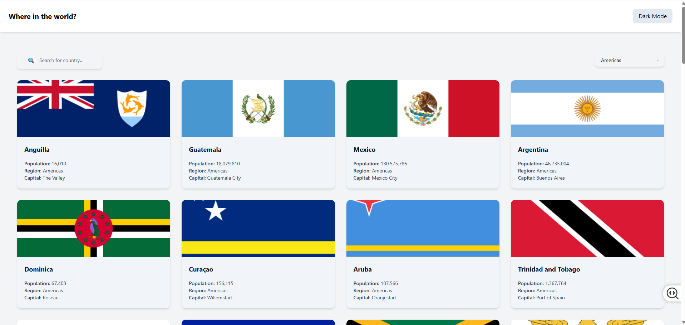
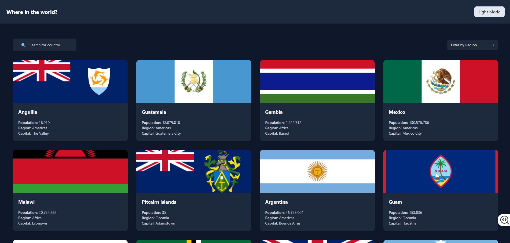
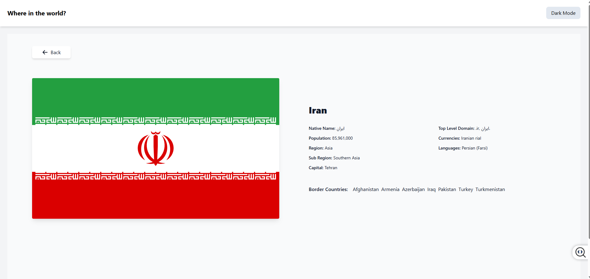
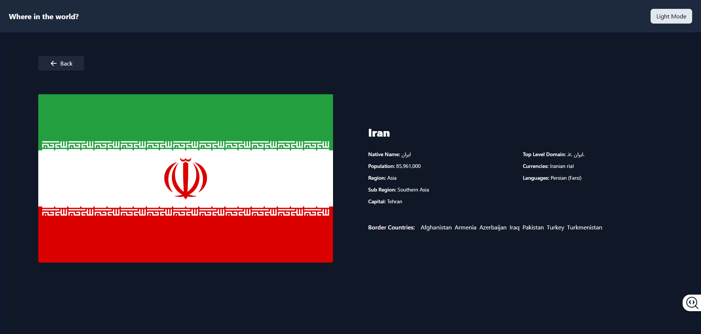

# Frontend Mentor - REST Countries API with color theme switcher solution

This is a solution to the [REST Countries API with color theme switcher challenge on Frontend Mentor](https://www.frontendmentor.io/challenges/rest-countries-api-with-color-theme-switcher-5cacc469fec04111f7b848ca). 

## Table of contents

- [Overview](#overview)
  - [The challenge](#the-challenge)
  - [Screenshot](#screenshot)
  - [Links](#links)
- [My process](#my-process)
  - [Built with](#built-with)
  - [What I learned](#what-i-learned)
  - [Continued development](#continued-development)
  - [Useful resources](#useful-resources)
- [Author](#author)
- [Reflections](#Reflections)


## Overview

### The challenge

Users should be able to:

- See all countries from the API on the homepage
- Search for a country using an `input` field
- Filter countries by region
- Click on a country to see more detailed information on a separate page
- Click through to the border countries on the detail page
- Toggle the color scheme between light and dark mode *(optional)*

### Screenshot






### Links

- Solution URL: [GitHub Repo](https://github.com/traceynicole71-cloud/MOD11-Project-React-REST-Countries)
- Live Site URL: [Live Demo](https://keokistevenson.github.io/RestCountriesAPIwithColorThemeSwitcher/)

## My process

### Built with

- Semantic HTML5 markup
- React
- TypeScript

### What we learned

As a team, we have enjoyed learning and applying advanced React concepts such as useState, useEffect, custom hooks, advanced custom hooks, the Context API, and React Router. These topics helped us better understand component communication, state management, reusable logic, and navigation within modern React applications. Through hands-on projects and practice, we strengthened our problem-solving and collaboration skills while building more interactive and organized applications. We are excited to continue expanding our knowledge in the upcoming modules and apply these concepts to even more complex projects.

See our code snippets below:

``` React: Routing and Context API
function App() {
  return (
    <BrowserRouter>
      <ThemeProvider>
        <Routes>
          <Route path="/" element={<LayoutWrapper />}>
            <Route index element={<Home />} />
            <Route path="country/:countryCode" element={<Detail />} />
          </Route>
        </Routes>
      </ThemeProvider>
    </BrowserRouter>
  );
}

export default App;
```

### Continued development

As a team, we are excited to continue learning about backend development, authentication, middleware, and full-stack MERN applications in the upcoming weeks. We look forward to exploring technologies such as Node.js, Express, MongoDB, and deployment practices to better understand how modern web applications are built and maintained. We are eager to strengthen our technical skills, collaborate on new challenges, and apply what we learn through hands-on projects. These upcoming modules will help us continue growing as developers and prepare us for more advanced real-world applications.


### Useful resources

- [Example resource 1](https://github.com/facebook/react/issues/14920) - Addresses ESLint rule that verifies the list of dependencies for useEffect hook.
- [Example resource 2](https://www.youtube.com/watch?v=ngVvDegsAW8&pp=0gcJCQMLAYcqIYzv) - This video discusses state management in React and Context API useContext .
- [Example resource 3](https://www.youtube.com/watch?v=XF1_MlZ5l6M) - This video discusses how to use React Hook -- useContext in particular


## Collaborators

- Tracey Roberts
- Monica Davila
- Quashean Armstrong
- Keoki Stevenson

We are a team of Full-Stack software developers specializing in building scalable web applications React and Typescript. We enjoy working on systems end-to-end—from web applications.
